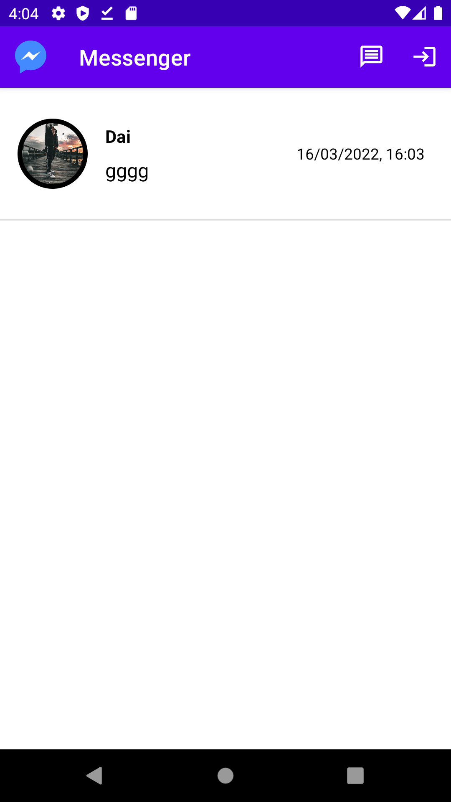
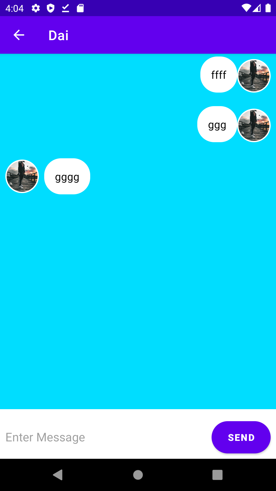
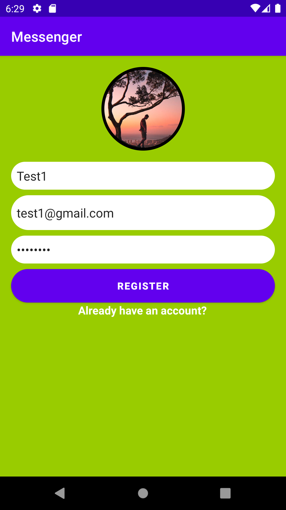
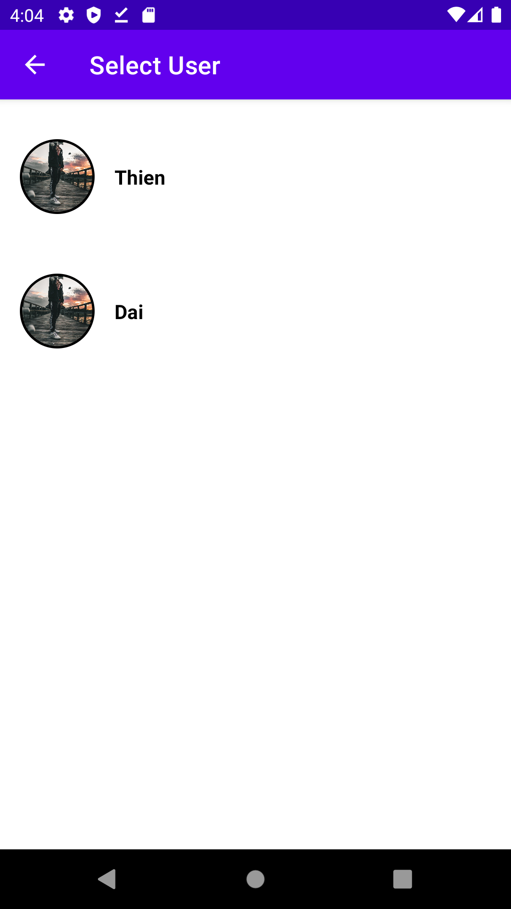

"# kotlin_messenger" 
# Messenger Kotlin

This is a clone app about Messenger. I create a real-time chat app with firebase.

## Preview
   


## Installation
Clone this repository and import into **Android Studio**
```bash
git clone git@github.com:wolox/<reponame>.git
```

## Built with
* Kotlin
* Firebase
* [CircleImageView](https://github.com/hdodenhof/CircleImageView)
* [Groupie](https://github.com/lisawray/groupie)
* [Picasso](https://square.github.io/picasso/)
